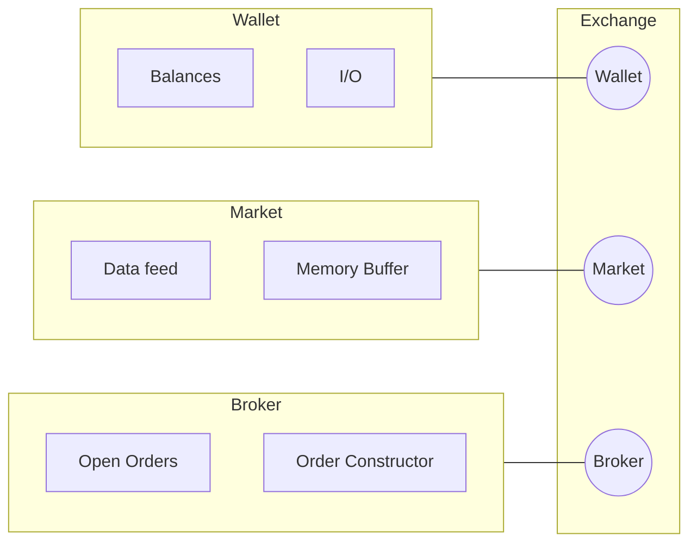

<p align="center">
  
</p>


### Notes

- [ ] Build out base memory buffer functionality into the market class. Have custom Buffer class implimentation
  - [ ] Build out baseline feature / feature set classes which Market classes should expect. These feature classes actually control the memory buffer directly that way we dont have to rewrite market classes for different datasets / asset types / strategies etc. 
  - [ ] Need to make local market class serve historical orderbook data as well, feature classes to operate on this.

- [ ] Resolve the ugliness of `wallet, broker, market` input style. Create a new class to wrap them in that the investor accepts as input.
- [ ] Trading rate limiter as part of the investor configuration!
- [ ] Make local market get_state call get_features in a way that is contengent on the market config such that the num of lagged observations and feature classes can be called in a consistent way with what will be used during live trading.
- [ ] Wallet config, "balances" paramter no longer optional but creates a ftx subaccount to deploy the strategy on. This would make a subaccount and transfer money from main wallet to the sub account. The hard part with this is making everything handle sub accounts. 
- [ ] Fully functioning limit orders / order cancellation for the local object classes.
  - [ ] These orders need to be streamed live (local) market data so they know when to execute. A investor base method that calls a status method at every evaluate_market() time step! Note this is very fast since often you wont have that many orders out at a given time. The status method for a local order will take price as input and trigger the withdrawl from wallet. If it is a live order, it will trigger a withdrawl from the local wallet, since we are emulating the ftx wallet. Good accounting!

```yaml
wallet:
    subaccount: 'geezer'
    balance: 10000
```

## Design



```mermaid

flowchart LR

    id1([Random Investor])

    subgraph Exchange Object
    id2([Broker])
    id3([Wallet])
    id4([Market])
    end

    id1-->|Orders| id2
    id3-->|Available Assets| id1
    id4-->|Data| id1
    id2-->|Filled Orders| id3
    id2-.-|Constructor| id1
````

### Links

- SeaPearl: [arxiv](https://arxiv.org/pdf/2102.09193v1.pdf) [github](https://github.com/corail-research/SeaPearl.jl)
- [PPO with a great design](https://github.com/google/flax/tree/main/examples/ppo/)
- [upenn course](https://gnn.seas.upenn.edu/wp-content/uploads/2020/11/lecture_11_handout.pdf)
- [TGN](https://arxiv.org/pdf/2006.10637.pdf)
- [trading algos in rust](https://github.com/fabianboesiger)
- [Temport GNN Architectures](https://arxiv.org/pdf/2005.11650.pdf)
