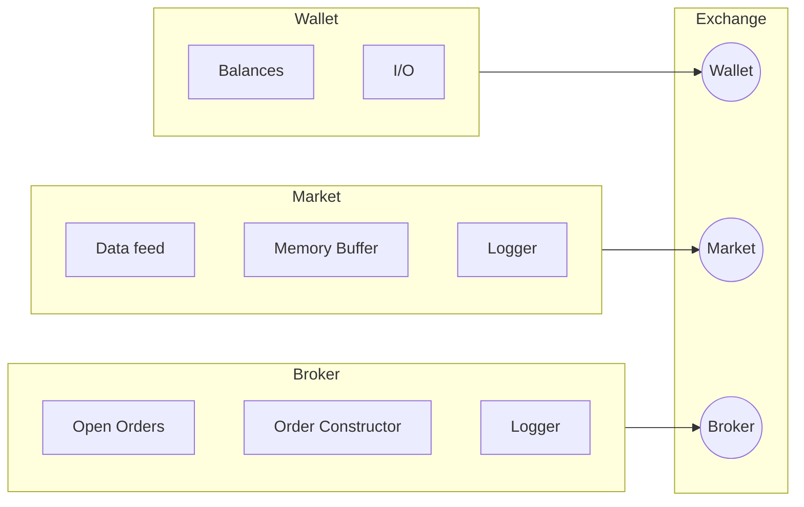

# lattice

## Design

### Links

- SeaPearl: [arxiv](https://arxiv.org/pdf/2102.09193v1.pdf) [github](https://github.com/corail-research/SeaPearl.jl)
- [PPO with a great design](https://github.com/google/flax/tree/main/examples/ppo/)
- [upenn course](https://gnn.seas.upenn.edu/wp-content/uploads/2020/11/lecture_11_handout.pdf)
- [TGN](https://arxiv.org/pdf/2006.10637.pdf)
- [trading algos in rust](https://github.com/fabianboesiger)
