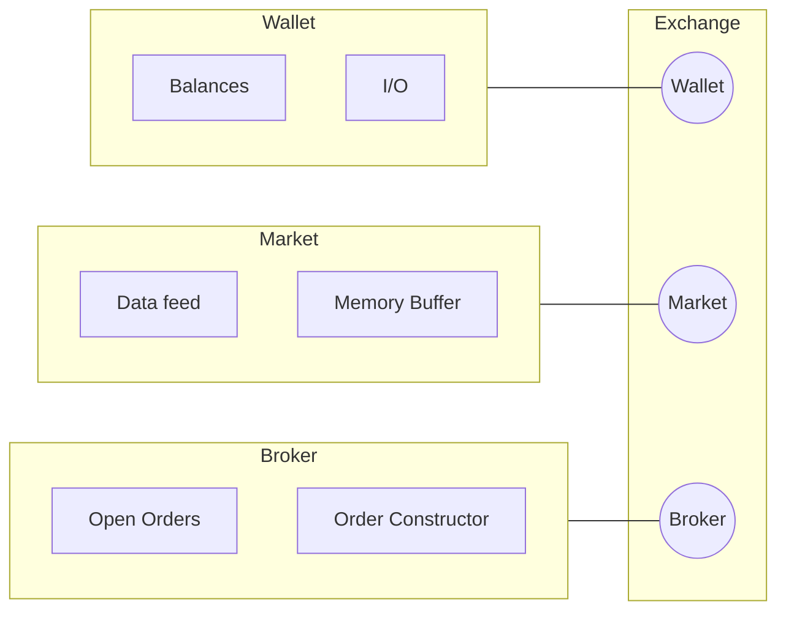

<p align="center">
  
</p>

# lattice


## Design



```mermaid

flowchart LR

    id1([Random Investor])

    subgraph Exchange Object
    id2([Broker])
    id3([Wallet])
    id4([Market])
    end

    id1-->|Orders| id2
    id3-->|Available Assets| id1
    id4-->|Data| id1
    id2-->|Filled Orders| id3
    id2-.-|Constructor| id1
````

### Notes

- [X] Decorators so that the configs can directly be injected into the objects. This enforces that the configs really are the true interface.
- [ ] Rewarite yaml checker to use https://pypi.org/project/strictyaml/
- [ ] Rewrite the local orders code using pyarrow.dataset
- [ ] Build out baseline feature / feature set classes which Market classes should expect. These feature classes actually control the memory buffer directly that way we dont have to rewrite market classes for different datasets / asset types / strategies etc. 
- [ ] Make FTXOrder baseclass have api methods, _secret_sign_method() etc. Can just delete the ftx client. This is especially true because I will want to make my own so I can pull higher resolution data. Can have an FTXClient base class that all of these methods can inherit from. Replace the exchanges directory with clients. This will make it easy to write out base api functionality for a number of exchanges without having to have a monolith class. Instead the functionality can incrimentally be built out along with the repo to suit my needs. 

### Links

- SeaPearl: [arxiv](https://arxiv.org/pdf/2102.09193v1.pdf) [github](https://github.com/corail-research/SeaPearl.jl)
- [PPO with a great design](https://github.com/google/flax/tree/main/examples/ppo/)
- [upenn course](https://gnn.seas.upenn.edu/wp-content/uploads/2020/11/lecture_11_handout.pdf)
- [TGN](https://arxiv.org/pdf/2006.10637.pdf)
- [trading algos in rust](https://github.com/fabianboesiger)
